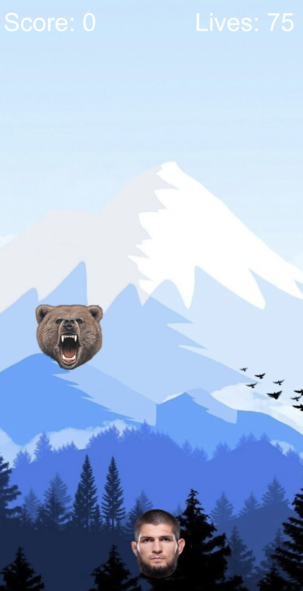
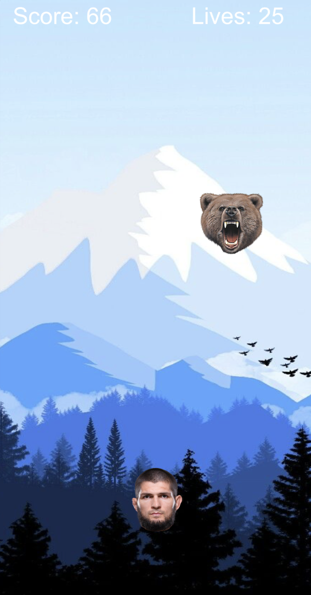
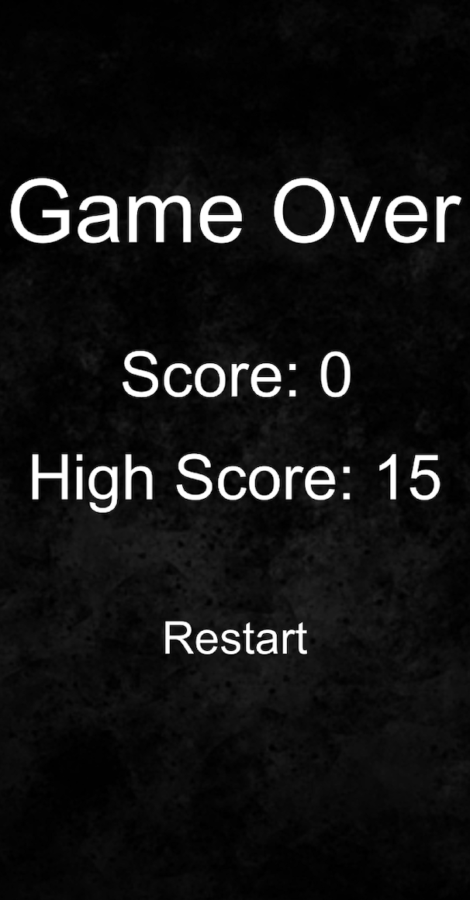

# Khabib Fight Bears SwiftUI Game

Welcome to the SwiftUI game documentation! 

This game is a variation of a classic shooter with a touch of UFC. The main character is Khabib, a Dagestani fighter in the mountainous region of Russia who allegedly fought bears as a child. In this shooter, Khabib can fight bears in honour of his character and his childhood.

## Getting Started

Unfortunately this game is not deployed, however the source code is all intact 
and can be cloned down.

## Structure

The basic logic of the application exists within two scenes. One is a GameScene which consists of the logic of the shooter and the other is the GameOverScene.

## Special Features

The high score of the game is stored indefinitely. Khabib has 100 Health and each time he is hit by a bear, his health plummets by 25 points. If he reaches 0, game over.

## Screenshots

## Future Work

I would like to implement different levels and different maps. Right now, the only map available is the mountainous region of Dagestan.